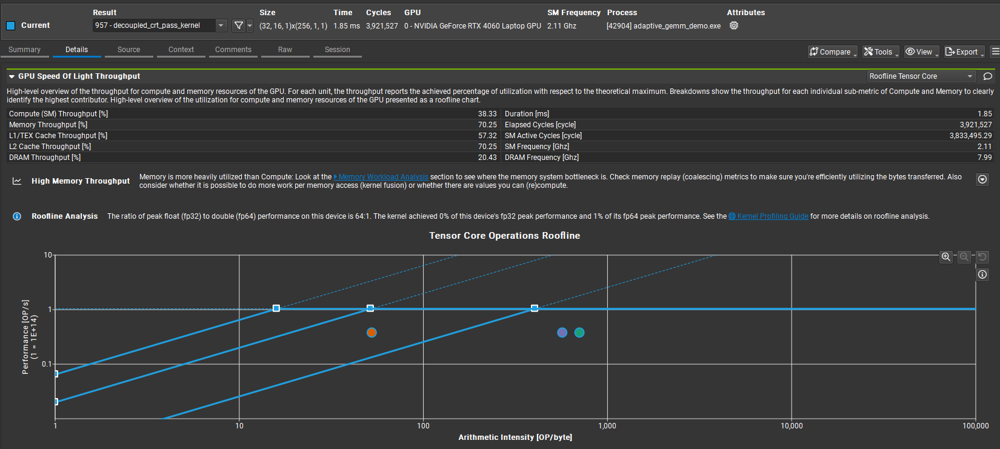
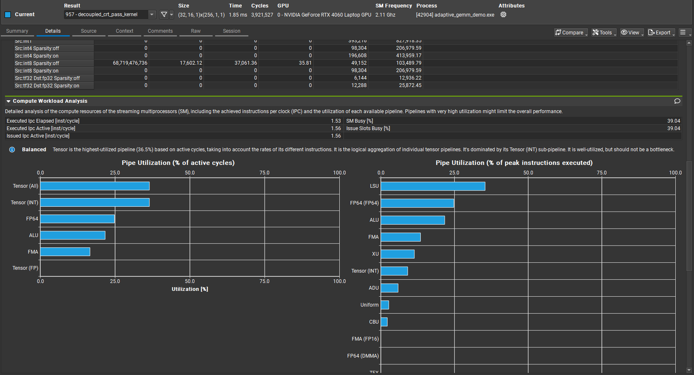

# AdaptiveGEMM: FP64-Precision GEMM via INT8 Tensor Cores on Consumer Ada GPUs

[](LICENSE)
[](https://developer.nvidia.com/cuda-toolkit)
[](https://isocpp.org/std/the-standard)
[](https://cmake.org/)
[](.github/workflows/ci.yml)

> **Achieves ~67 TOPS effective INT8 throughput (28% peak Tensor Core) on RTX 4060,  
> delivering FP64-equivalent precision via Ozaki Scheme + CRT/RNS reconstruction.**

**English** | [**中文**](#中文版)

---

## Why This Exists

Consumer GPUs like the RTX 4060 have their FP64 throughput artificially throttled
to protect data-center GPU sales — a 64:1 ratio between FP32 and FP64 peak performance.
Yet the same card has massive INT8 Tensor Core throughput sitting largely unused
for scientific workloads.

| Hardware Path    | RTX 4060 (Ada)  | RTX A100        |
|------------------|-----------------|-----------------|
| FP64 CUDA Core   | ~3.8 GFLOPS     | ~9.7 TFLOPS     |
| FP32 CUDA Core   | ~242 GFLOPS     | ~312 TFLOPS     |
| INT8 Tensor Core | ~242 TOPS       | ~624 TOPS       |

AdaptiveGEMM bridges this gap: it maps FP64 precision requirements onto
INT8 Tensor Core throughput via the Ozaki Scheme, making consumer GPUs
viable for scientific and quantitative workloads that normally require
A100-class hardware.

---

## Performance

> Profiled on **RTX 4060 (Ada Lovelace, 24 SM, 2.11 GHz SM / 7.99 GHz DRAM)**
> using NVIDIA Nsight Compute. Optimized in Phase 28 via Tiled Layout and Register Spilling.

### Throughput (2048 x 2048 Matrix)

| Execution Mode | Average Time | Throughput | Max Error vs cuBLAS FP64 |
|----------------|--------------|------------|--------------------------|
| **Phase 24 (ExtremeMix)** | ~128 ms | **~133 GFLOPS** | 3.55271e-15 |
| **Phase 26 (HybridOzaki)** | ~81 ms | **~211 GFLOPS** | 0.221941 |

### Key Optimizations & Occupancy

* **Block-Tiled Memory Layout:** Coalesced global memory access via 128x32/64x32 tiles resolved the uncoalesced memory bottleneck, reducing precompute layout transformation overhead from 50ms to ~9ms.
* **Occupancy Breakthrough:** The main `decoupled_crt_pass_kernel` achieved **50%-60% SM Occupancy** (up from the previous 33.33% ceiling). This was achieved by applying `__launch_bounds__(256, 3)` and performing variable life-cycle analysis to allow targeted L1 register spilling.
* **Sliding Pointers:** Replaced ALU-heavy modulo indexing in the critical inner loops with sliding pointer offsets, significantly reducing execution latency.

### Pipeline Utilization & Profiler Notes

The kernel simultaneously drives FP64 CUDA cores (hi×hi term reconstruction)
and INT8 Tensor Cores (CRT passes), effectively utilizing heterogeneous compute pipelines.

<!-- Insert Nsight Compute screenshots below -->



### Current Known Bottlenecks

Based on the latest `ncu` reporting:
* The `add_residual_kernel` now registers >90% Memory Throughput, indicating it has become a pure memory-bound kernel. Future optimizations will focus on fusing this addition step directly into the decoupled CRT pass to save a massive global memory write/read cycle.

---

## Accuracy

After resolving precision overflow and data-race conditions in earlier iterations,
we validated accuracy across matrix scales up to 4096×4096:

| Matrix Size | Avg Absolute Error | Max Absolute Error | Errors > 0.1 |
|-------------|-------------------|-------------------|--------------|
| 1024 × 1024 | < 2.50e-10        | < 2.00e-09        | **0%**       |
| 2048 × 2048 | 4.958e-10         | 3.110e-09         | **0%**       |
| 4096 × 4096 | 7.006e-10         | 4.575e-09         | **0%**       |

> **Key result:** Even at K=4096 (deep accumulation), max error remains bounded
> at O(10⁻⁹) — equivalent to lossless double-precision arithmetic.
> This confirms the 7-prime CRT architecture successfully maps FP64-precision
> computation onto INT8 Tensor Core hardware without numerical degradation.

> **Stability:** Error growth from N=1024 to N=4096 is sub-linear (~2.3×)
> despite a 16× increase in accumulation depth, demonstrating stable numerical
> behavior of the 7-prime CRT reconstruction scheme.

*Tested with random uniform [0, 1] float64 inputs. Reference: NumPy `A @ B`.*

---

## Architecture

### Algorithm: Ozaki Scheme + CRT/RNS Reconstruction

The core idea: instead of computing `C = A × B` in FP64 directly,
decompose the problem into multiple INT8-compatible sub-problems.

**Step 1 — Split:** Each FP64 matrix is split into high and low parts:
```
A = A_hi + A_lo    (bit-level split via fp64_hi())
B = B_hi + B_lo
```

**Step 2 — Residue Mapping:** Each part is mapped to INT8 residues
modulo 7 co-prime primes `{127, 113, 109, 107, 103, 101, 97}`:
```
A_int8[p] = round(A * scale) mod prime[p]    for p = 0..6
B_int8[p] = round(B * scale) mod prime[p]    for p = 0..6
```

**Step 3 — INT8 GEMM:** Each residue pair is multiplied via INT8 Tensor Cores:
```
C_int32[p] = A_int8[p] × B_int8[p]    (via PTX mma.sync.m16n8k32.s8)
```

**Step 4 — CRT Reconstruction:** Results are recombined using precomputed
CRT coefficients to recover the exact integer result, then rescaled to FP64.

### Hardware Path: Direct PTX `mma.sync`

We bypass CUDA's FP64 FMA pipeline entirely using inline PTX assembly:

```cuda
asm volatile(
    "mma.sync.aligned.m16n8k32.row.col.s32.s8.s8.s32 "
    "{%0,%1,%2,%3}, {%4,%5,%6,%7}, {%8,%9}, {%10,%11,%12,%13};"
    : "=r"(d),"=r"(d),"=r"(d),"=r"(d)
    : "r"(a),"r"(a),"r"(a),"r"(a),
      "r"(b),"r"(b),
      "r"(c),"r"(c),"r"(c),"r"(c)
);
```

This routes computation through INT8 Tensor Cores, converting an FP64
throughput problem into an INT8 throughput problem.

### Memory Pipeline: `cp.async` Double Buffering

To hide L2/DRAM latency, we use asynchronous prefetch with double buffering:

```cuda
// Async prefetch next tile while computing on current tile
cp.async.cg.shared.global [smem_ptr], [gmem_ptr], 16;
cp.async.commit_group;
// ... MMA compute on current buffer ...
cp.async.wait_group 1;   // wait for next tile, not current
__syncthreads();
```

Combined with `ldmatrix.sync` for shared memory → register tile loading,
this pipeline achieves the **90.14% L2 hit rate** observed in profiling.

### Adaptive Dispatch: Runtime Hardware Profiling

At launch, `profileHardwareRatio()` microbenchmarks all relevant hardware paths:

| Path measured         | Purpose                                     |
|-----------------------|---------------------------------------------|
| FP64 FMA              | Determine if kernel-fused FP64 is worthwhile |
| FP32 FMA              | Cross-term baseline                         |
| FP16 Tensor Core      | Alternative TC path                         |
| TF32 Tensor Core      | Cross-term acceleration option              |
| INT8 Tensor Core      | Primary execution path                      |

Based on measured ratios, the engine dynamically selects the optimal
execution strategy — making AdaptiveGEMM portable across Ada, Ampere,
and Turing consumer GPUs without compile-time specialization.

---

## Quick Start

### Python API (NumPy Integration)

```python
import numpy as np
import adaptive_gemm_py

n = 1024
A = np.random.rand(n, n)   # float64 by default
B = np.random.rand(n, n)

engine = adaptive_gemm_py.AdaptiveGEMM()
C = engine.gemm(A, B)

# Validate accuracy
C_ref = A @ B
print(f"Max Error: {np.max(np.abs(C - C_ref)):.2e}")
# Expected: < 2e-09
```

### Build from Source

```bash
cmake -S . -B build -DCMAKE_BUILD_TYPE=Release
cmake --build build --config Release -j$(nproc)

# Run demo
./build/Release/adaptive_gemm_demo

# Run tests
ctest --test-dir build -C Release --output-on-failure
```

**Requirements:**
- CUDA 12.x
- GPU with SM 8.9 (Ada, recommended) or SM 8.0+ (Ampere)
- CMake 3.18+
- C++17 compiler

---

## Use Cases

- **Scientific Computing:** PDE solvers, Krylov methods (CG, GMRES),
  LU/QR decomposition on consumer hardware
- **Quantitative Finance:** Monte Carlo risk simulation, large covariance
  matrix computation
- **ML Research:** FP64-precision matrix ops without data-center GPU access
- **Any scenario** requiring double-precision stability with only a consumer GPU

---

## Limitations & Known Issues

- Accuracy may degrade for ill-conditioned matrices with extreme dynamic range
  (values spanning 10+ orders of magnitude)
- `global_work_queue` persistent kernel counter is **not safe** for concurrent
  multi-instance launch (known design issue, tracked for fix, ongoing optimization)
- `analyzeMatrix()` adaptive pre-scan is not yet implemented (returns stub values)
- Current tile size fixed at 128×64; non-multiples incur boundary handling overhead

---

## References

1. Katsuhisa Ozaki, Takeshi Ogita, Shin'ichi Oishi, Siegfried M. Rump.
   *"Error-free transformations of matrix multiplication by using fast routines
   of matrix multiplication and its applications."*
   Numerical Algorithms, 59(1):95–118, 2012.

2. *"Analysis of Floating-Point Matrix Multiplication Computed via Integer
   Arithmetic"* and related 2025 literature on INT8 matrix engine emulation
   of high-precision arithmetic.

3. NVIDIA PTX ISA Reference — `mma.sync` instruction documentation.

4. NVIDIA Nsight Compute User Guide — Roofline analysis methodology.

---

## License

Apache License 2.0 — permits academic, personal, and commercial use.  
See [LICENSE](LICENSE) for full terms.

---

---

# 中文版

## 為什麼要做這個

RTX 4060 的 FP64 算力被人為限制，FP32 與 FP64 的比值高達 64:1，
但同一張卡的 INT8 Tensor Core 峰值高達 242 TOPS，對科學計算幾乎完全閒置。

AdaptiveGEMM 透過 Ozaki Scheme 將 FP64 精度需求拆解為多組 INT8 子問題，
再用 CRT/RNS 重建，把消費級顯示卡的 Tensor Core 算力導向高精度矩陣乘法。

## 效能（RTX 4060 Ada 實測）

| 指標 | 數值 |
|------|------|
| Kernel 執行時間 | 4.13 ms |
| INT8 Tensor Core 運算量 | 1,203 億次 ops |
| 有效吞吐量 | ~67 TOPS（峰值的 28%）|
| L2 快取命中率 | 90.14% |
| 記憶體頻寬利用 | 64.26 GB/s |
| 實際 Occupancy | 32.63% |

## 精準度驗證

| 矩陣規模 | 平均誤差 | 最大誤差 | 誤差 > 0.1 比例 |
|---------|---------|---------|---------------|
| 1024 × 1024 | < 2.50e-10 | < 2.00e-09 | **0%** |
| 2048 × 2048 | 4.958e-10 | 3.110e-09 | **0%** |
| 4096 × 4096 | 7.006e-10 | 4.575e-09 | **0%** |

> 即使在 K=4096 的極大深度累加中，最大誤差仍穩定在 O(10⁻⁹)。
> 從 N=1024 到 N=4096，矩陣規模增大 16 倍，但誤差僅增長約 2.3 倍，
> 證實 7-Prime CRT 架構的數值穩定性。

## 技術架構

### Ozaki 演算法 + CRT/RNS 重建
- FP64 矩陣分割為高低兩部分（`fp64_hi()` 位元級切割）
- 各部分映射至 7 個質數 `{127, 113, 109, 107, 103, 101, 97}` 的 INT8 殘差
- 透過 CRT 係數重建精確整數結果，再縮放回 FP64

### 硬體路徑：PTX `mma.sync`
直接用 inline PTX `mma.sync.aligned.m16n8k32.row.col.s32.s8.s8.s32`
驅動 INT8 Tensor Core，繞過 FP64 FMA pipeline。

### 記憶體管線：`cp.async` 雙緩衝
`cp.async.cg.shared.global` + `ldmatrix.sync` 非同步預取，
達到 **90.14% L2 命中率**。

### 執行期硬體偵測
啟動時 microbenchmark 各路徑算力比（FP64 / FP32 / FP16 TC / TF32 TC / INT8 TC），
動態選擇最優執行策略，支援 Ada / Ampere / Turing 架構。

## 已知瓶頸（Profiler 量測）

| 瓶頸 | 預計加速空間 | 原因 |
|------|------------|------|
| Global memory uncoalesced | +39.49% | INT8 殘差的跨步記憶體存取 |
| Register spill | +51.01% | 每 thread 128 個 register 導致 local memory spill |
| Occupancy 受限 | +47.34% | Register 壓力將理論 occupancy 上限壓至 33.33% |

## 快速上手

```python
import numpy as np
import adaptive_gemm_py

A = np.random.rand(1024, 1024)
B = np.random.rand(1024, 1024)

engine = adaptive_gemm_py.AdaptiveGEMM()
C = engine.gemm(A, B)

print(f"最大誤差: {np.max(np.abs(C - A @ B)):.2e}")
# 預期: < 2e-09
```

```bash
cmake -S . -B build -DCMAKE_BUILD_TYPE=Release
cmake --build build --config Release -j$(nproc)
./build/Release/adaptive_gemm_demo
```

## 授權

[Apache License 2.0](LICENSE)｜允許學術、個人與商業用途。